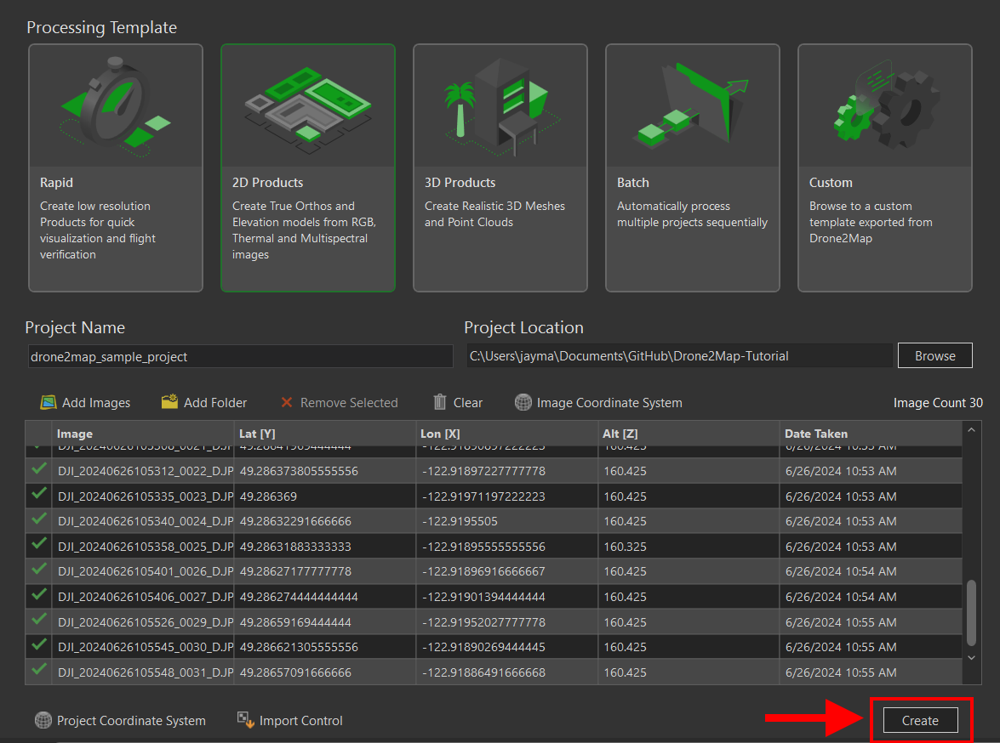

# Drone2Map Tutorial 
Author: Jay Matsushiba (jmatsush@sfu.ca)
Date: February 11 2025 
Tutorial Developed for ArcGIS Drone2Map Software Version 2023.2.0

This tutorial, the sample data, and the sample project can be downloaded from: https://github.com/JayMatsushiba/Drone2Map-Tutorial.git 

## Introduction 
Aerial drones, or officially known as Remotely Piloted Aircraft Systems (RPAS) in Canada, have enjoyed increased capabilities and ease of use, simultatenous with decreasing cost. These factors have increased their adoption in a range of fields, including in geography for producing maps. Now, with inexpensive hardware (less than $1000 for the RPAS) and software, we can create high resolution georeferenced data products. In this tutorial, we will be showing how to create using our own orthophotos, digital surface models, and digital terrain models with ArcGIS Drone2Map. These output data products will be ready for use in other Geographic Information Systems (GIS), such as ArcGIS Pro and QGIS. 

This tutorial assumes some basic experience with using GIS software, particularly ArcGIS Pro. 

## Input Data 
### Basic RPAS Flight Plan Considerations 
This tutorial assumes that you have already collected the images from your RPAS platform of choice. This tutorial will not go into depth about how to plan your RPAS flight, but as a summary for ensuring high quality outputs:
- Images should overlap one another by around 80%. 
- Images should cover beyond the area of interest, since the quality / accuracy around the edges of your flight plan area will be lower. 
- Fly your RPAS lower (as safely possible) to increase resolution of your data, but be aware that this will also increase the time of the flight and the processing time.
- Relative vs. Absolute Accuracy - with good images, we can produce high relative accuracy data products. However, for high absolute accuracy (ex. for aligning to other spatial data products), we need to use Ground Control Points. 
- Keep weather and lighting in mind for increasing image quality. Overcast days are ideal, since they reduce harsh shadows. Flying when the sun is highest in the sky (solar noon) will also reduce shadows and glare. 
- Slower flight speeds will reduce motion blur in the images. 

Another key consideration is the view angle of the RPAS camera when taking the images. For 2D orthophotos, digital terrain models, etc., we use images taken directly below the RPAS (called nadir). For creating 3D models, we need to use images taken from an angle other than nadir (called oblique). In the `sample_images` folder, we have a collection of nadir images taken on Burnaby Mountain. As we only have nadir images here, we can only create 2D data products. 

### Review Images
> <strong>"Garbage in, garbage out!"</strong>
> -- <cite>Some data scientist long ago</cite>

Creating high quality output data products (including spatial data) requires high quality input data! In our case, we need to make sure the images that we have taken from the RPAS are of sufficient quality. 
#### Open Images
There are no hard and fast general rules for deciding whether an image is good enough to include. For this tutorial though, we should open the photos that we have and see if there are issues that are immediately obvious. These problem images should not be included as an input to the Drone2Map software in later steps of this tutorial. 

##### Common issues include: 
- Blurry images 
- Over- or under-exposed images (too bright or too dark)
- Images not of the area of interest (ex. test images taken at the beginning of the flight)

#### Checking for GPS metadata
The input data for creating our spatial data products in this workflow will be the photos we have taken from the RPAS with GPS metadata attached. Images taken by the RPAS should automatically have the coordinates recorded. 

You can check for GPS metadata by:
1. Right clicking the image file in the File Explorer
2. Click `Properties` in the dropdown that appears.
3. Click the `Details` tab in the `Properties` window that appears. 
4. Scroll down to see if there is a `GPS` section with `Latitude`, `Longitude`, and `Altitude` properties. 

## Using ArcGIS Drone2Map 
### Installation Instructions 
Simon Fraser University provides an Education Site License for students, staff, and researchers to use Drone2Map for academic use only. Details on how to download, install, and authenticate a copy of the software on your computer can be found here: https://www.lib.sfu.ca/find/other-materials/data-gis/gis/software-arc-gis#-arcgis-drone2map (This link requires you to login)

### Creating a New Project
When you open Drone2Map for the first time, you should be greeted by the following window. 
1. We are going to be creating 2D products, so we can select `2D Products` as the option under `Processing Template`. 
2. Put in your desired project name under `Project Name`.
3. Change the `Project Location` to where you would like to save the project on your computer by hitting the `Browse` button. 

### Import Images
You can add the images from the `sample_images` folder, or you can use your own set of images. 
1. Click the `Add Images` button.
2. This should open the `Browse for Images` window. In this window, you can select the images you would like to add to your project. 

> <strong>TOP TIP</strong>
> You can select multiple images with `Ctrl + Left Click`. You can also unselect images with this same shortcut. You can select a range of images by selecting one image, then `Shift + Left Click`. 

### Finally, hit `Create`!

### Drone2Map Interface
If your project has been initialized successfully, you should be greeted with the Drone2Map interface below. The map view should correspond generally to where you conducted your flight and collected the images. 

If you have worked with ArcGIS Pro before, this interface should look quite familiar. Given that ArcGIS Pro and Drone2Map are both created by the same company, ESRI, there are many similarities in the user interface between the two. If you are an experienced user of ArcGIS Pro, this interface should be fairly intuitive to use. 

1. `Ribbon` - contains the various tools, project navigation, sharing options for the Drone2Map project.
2. `Content` - describes the layers that are included in the selected map.
3. `Map` - visualizes the map, with the ability to toggle between 2D and 3D maps 
4. `Manage` - prompts user along the workflow 

### Basic Options for Your Project
For all of the basic options, we are going to leave them as the defaults as presented by Drone2Map. I would encourage though that you hover over the `&#9432;` icons next to the parameters and get some additional context about the options.

#### Adjust Images
1. Click `Adjust Images` to view options. 
2. This window has parameters for adjusting the images and input data (from the metadata attached to the images). Leave these at their defaults.

#### Dense Matching
1. Click `Dense Matching` to view options.
2. This window has parameters for the dense matching algorithms. Dense matching refers to the process of comparing two overlapping images, to identify points likely to be in common between the two images. This is then repeated for all of the images included in the data. Leave these at their defaults.

#### 2D Products
1. Click `2D Products` to view options.
2. This window has the parameters for the output raster 2D products. These include orthophotos, digital surface models (DSM), and digital terrain models (DTM). As a review of the differences: 
    - <strong>Ortho(photos)</strong> are stitched together from images from our RPAS, resulting in a georeferenced raster spatial layer that describes colour information. 
    - <strong>Digital Surface Models (DSM)</strong> are raster spatial layers that describe the height of each cell, including natural (ex. trees) and built features (ex. houses).
    - <strong>Digital Terrain Models (DTM)</strong> are raster spatial layers that describe the height of each cell, with natural and built features removed. This is not enabled by default.
3. You can leave these parameters as their defaults. 

### Processing! 
1. Click on the `Start` button that is within the `Processing` group, under the `Home` menu. 
2. Your processing has began! You should see at the bottom of the `Manage` pane the progress bar appear. This processing will take a few minutes, so feel free to take a short break here. Once complete, you'll see the progress bar at 100% and the data products will be added to your `2D Map`. 

## End Products
Once the processing has complete, you will see the data products added to your `2D Map`. These should include the `True Ortho` and the `Digital Surface Model`. Just like in ArcGIS Pro, we can see these layers in the `Contents` pane on the left side of the interface. You can select and reorder the layers to review the outputs and confirm that they are what you expect. 

### True Ortho

### Digital Surface Model 

### Export Files from Drone2Map
1. We can export the rasters we produced by right clicking the layer in the `Contents`, hovering over the `Data` in the dropdown, and then clicking `Export Raster`. 
2. We should change the `Output Raster Dataset` parameter to change the save location, depending on how you are organizing your files. Make sure the `Output Format` is `TIFF`. Otherwise, leave the defaults. 
3. Hit `Export`.

### Import Files into ArcGIS Pro

## Other Tools 
### Creating 3D Models with Epic Games RealityCapture
Link: https://www.capturingreality.com/  

RealityCapture is a great tool for creating 3D models using a technique called photogrammetry. Photogrammetry involves using algorithms to find overlapping points between images to generate three-dimensional geometry. RealityCapture can handle data in the form of images and video files, even without GPS metadata. Therefore, it can be used for a wider range of situations compared to Drone2Map. It does require more powerful computer hardware compared to Drone2Map. In particular, RealityCapture requires a modern NVIDIA graphics card for full functionality. 

There are some good learning resources already produced by Epic Games and Quixel: https://dev.epicgames.com/community/learning/paths/yzG/unreal-engine-capturing-reality-principles-of-photogrammetry-and-scanning. The video games industry (~$200 billion annual revenue) is colossal compared to GIS (~$10 billion annual revenue), and therefore these tools that are used by the games industry have orders of magnitude more investment compared to conventional GIS solutions. I would invite you to explore and learn them!  